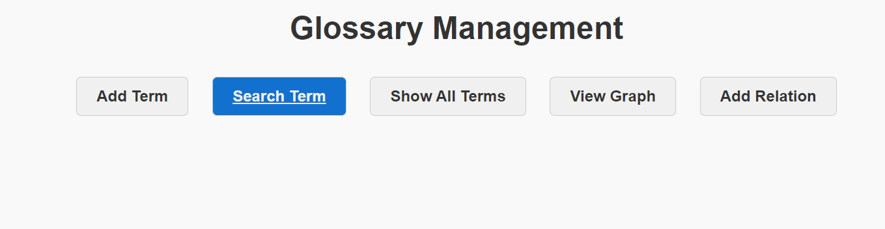
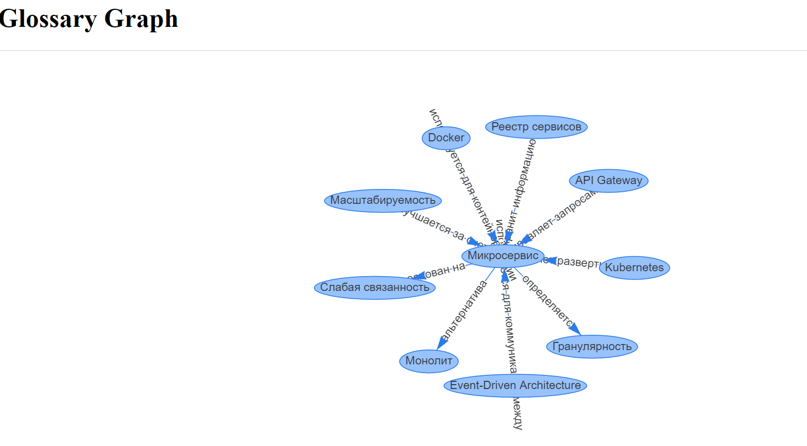

# ЗАПУСК
### Сборка образа
```bash
docker build -t glossary_app .
```
### Запуск контейнера
```bash
docker run -d --name mycontainer -p 80:80 glossary_app
```
### После запуска контейнера документация будет доступна по адресу
http://127.0.0.1/docs

## Глоссарий для хранения определений
1. Можно добавлять термины
  
2. Можно редактировать термины
   
3. Можно удалять термины
   
4. Можно искать термин по названию
   
5. Можно просматривать все термины
    
6. Можно просматривать граф с определениями
   